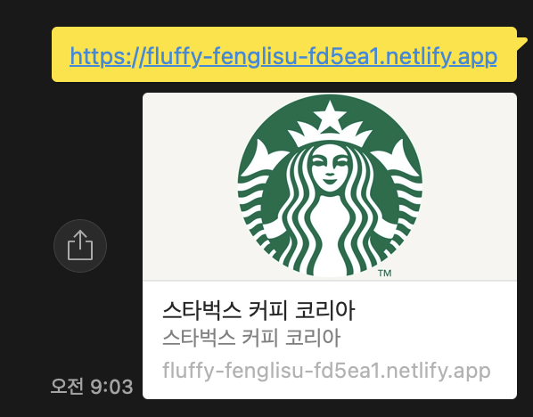

# STARBUCKS

<br/>
스타벅스 랜딩 페이지(홈페이지)를 만들어 보는 예제입니다.<br/>
랜딩 페이지 예제를 따라 공부하면서 배웠던 함수와 라이브러리 등을 간략하게 정리하여 설명합니다.<br/>

netlify<br/>
[Starbucks DEMO](https://fluffy-fenglisu-fd5ea1.netlify.app)

# 오픈 그래프(The Open Graph protocol)
웹페이지가 소셜 미디어(페이스북 등)로 공유될 때 우선적으로 활용되는 정보를 지정합니다.

KaKaoTalk -<br/>


```html
<meta property="og:type" content="website" />
<meta property="og:site_name" content="Starbucks" />
<meta property="og:title" content="Starbucks Coffee Korea" />
<meta property="og:description" content="스타벅스는 세계에서 가장 큰 다국적 커피 전문점으로, 64개국에서 총 23,187개의 매점을 운영하고 있습니다." />
<meta property="og:image" content="./images/starbucks_seo.jpg" />
<meta property="og:url" content="https://starbucks.co.kr" />
```

- `og:type` : 페이지의 유형(`website`, `video.movie`)
- `og:site_name` : 속한 사이트의 이름
- `og:title` : 페이지의 이름(제목)
- `og:descrition` : 페이지의 간단한 설명
- `og:image` : 페이지의 대표 이미지 주소(URL)
- `og:url` : 페이지의 주소(URL)

# 트위터 카드(Twitter Cards)
웹페이지가 소셜 미디어(트위터)로 공유될 때 우선적으로 활용되는 정보를 지정합니다.

```html
<meta property="twitter:card" content="summary" />
<meta property="twitter:site" content="Starbucks" />
<meta property="twitter:title" content="Starbucks Coffee Korea" />
<meta property="twitter:description" content="스타벅스는 세계에서 가장 큰 다국적 커피 전문점으로, 64개국에서 총 23,187개의 매점을 운영하고 있습니다." />
<meta property="twitter:image" content="./images/starbucks_seo.jpg" />
<meta property="twitter:url" content="https://starbucks.co.kr" />
```

- `twitter:card` : 페이지(카드)의 유형(`summary`, `player`)
- `twitter:site` : 속한 사이트의 이름
- `twitter:title` : 페이지의 이름(제목)
- `twitter:description` : 페이지의 간단한 설명
- `twitter:image` : 페이지의 대표 이미지 주소(URL)
- `twitter:url` : 패이지 주소(URL)


# Favicon(파비콘, favorites icon)
파비콘(favicon, 'favorites + icon') 똫는 패비콘이란 인터넷 웹 브라우저의 주소창에 표시되는 웹사이트나 웹페이지를 대표한 아이콘입니다.
([위키백과](https://ko.wikipedia.org/wiki/%ED%8C%8C%EB%B9%84%EC%BD%98))

```html
<link rel="icon" href="./favicon.png" />
```

- `favicon.ico` 64 x 64 (px) 또는 32 x 32 또는 16 x 16
- `favicon.png` 500 x 500 (px)

# Reset.css
각 브라우저의 기본 스타일을 초기화 합니다.

```html
<link rel="stylesheet" href="https://cdn.jsdelivr.net/npm/reset-css@5.0.1/reset.min.css" />
```

# Google Fonts
페이지에서 사용할 '나눔고딕' 폰트를 지정합니다.
[Google Fonts](https://fonts.google.com/)에서 고른 폰트 파일을 가져옵니다.

```html
<link rel="preconnect" href="https://fonts.gstatic.com" crossorigin>
<link href="https://fonts.googleapis.com/css2?family=Nanum+Gothic:wght@400;700&display=swap" rel="stylesheet">
```

페이지에 폰트를 적용(CSS 상속) 합니다.

```css
body {
  font-family: 'Nanum Gothic', sans-serif;
}
```

# Google Material Icons

[구글에서 제공하는 머터리얼 아이콘](https://m3.material.io/resources/icons)을 무료로 사용할 수 있습니다.<br/>
(웹폰트 형식 뿐만이 아니라 `SVG`와 `PNG` 형식으로도 아이콘을 제공하고 있습니다.)

```html
<link rel="stylesheet" href="https://fonts.googleapis.com/icon?family=Material+Icons" />
```
다음과 같이 사용할 수 있습니다.

```html
<div class="material-icons">upload</div>
```

# GSAP & ScrollToPlugin
[GSAP(The GreenSock Animation Platform)](https://greensock.com/gsap/)은 자바스크립트로 제어하는 타임라인 기반의 애니메이션 라이브러리 입니다. [ScrollToPlugin](https://greensock.com/scrolltoplugin/)은 스크롤 애니메이션을 지원하는 GSAP 플러그인입니다.

```html
<script src="https://cdnjs.cloudflare.com/ajax/libs/gsap/3.11.3/gsap.min.js" integrity="sha512-gmwBmiTVER57N3jYS3LinA9eb8aHrJua5iQD7yqYCKa5x6Jjc7VDVaEA0je0Lu0bP9j7tEjV3+1qUm6loO99Kw==" crossorigin="anonymous" referrerpolicy="no-referrer"></script>
<script src="https://cdnjs.cloudflare.com/ajax/libs/gsap/3.11.3/ScrollToPlugin.min.js" integrity="sha512-Eenw6RBFiF4rO89LCaB5fkd4WXI4Y7GSRxrLMMWx73dZNcl+dBU3/pJtITD2gTCoEGIf/Ph3spwp0zZnF+UEJg==" crossorigin="anonymous" referrerpolicy="no-referrer"></script>
```

# Swiper
[Swiper](https://swiperjs.com/)는 하드웨어 가속 전환과 여러 기본 동작을 갖춘 현대적인 슬라이드 라이브러리 입니다.

```html
<!-- in HEAD -->
<link rel="stylesheet" href="https://unpkg.com/swiper@6.8.4/swiper-bundle.min.css">
<script src="https://unpkg.com/swiper@6.8.4/swiper-bundle.min.js"></script>

<!-- in BODY -->
<div class="swiper-container">
  <div class="swiper-wrapper">
    <div class="swiper-slide">
      <a href="javascript:void(0)">크리스마스 & 연말연시 스타벅스 매장 영업시간 변경 안내</a>
    </div>
    <div class="swiper-slide">
      <a href="javascript:void(0)">[당첨자 발표] 2021 스타벅스 플래너 영수증 이벤트</a>
    </div>
    <div class="swiper-slide">
      <a href="javascript:void(0)">스타벅스커피 코리아 애플리케이션 버전 업데이트 안내</a>
    </div>
    <div class="swiper-slide">
      <a href="javascript:void(0)">[당첨자 발표] 뉴이어 전자영수증 이벤트</a>
    </div>
  </div>
</div>
```

[Swiper API](https://swiperjs.com/swiper-api)(옵션) 확인

```javascript
new Swiper(요소, 옵션);
```

```javascript
new Swiper('.notice-line .swiper-container', {
  direction: 'vertical', // 수직 슬라이드
  autoplay: true, // 자동 재생
  loop: true // 반복 재생
});
```

# Youtube API

[IFrame Player API](https://developers.google.com/youtube/iframe_api_reference?hl=ko)를 통해 Youtube 동영상을 제어할 수 있습니다.<br/>
유튜브 영상이 출력될 위치에 요소를 지정(생성) 합니다.

```html
<!-- in HEAD -->
<script defer src="./js/youtube.js"></script>

<!-- in BODY -->
<div id="player"></div>
```

[플레이어 매개변수(playerVars)](https://developers.google.com/youtube/player_parameters.html?playerVersion=HTML5&hl=ko#Parameters)에서 더 많은 옵션 확인하기

```javascript
// Youtube Iframe API를 비동기로 로드합니다.
const tag = document.createElement('script');
tag.src = "https://www.youtube.com/iframe_api";
const firstScriptTag = document.getElementsByTagName('script')[0];
firstScriptTag.parentNode.insertBefore(tag, firstScriptTag);

function onYouTubeIframeAPIReady() {
  // <div id="player"></div>
  new YT.Player('player', {
    videoId: 'An6LvWQuj_8', // 최초 재생할 유튜브 영상 ID
    playerVars: {
      autoplay: true, // 자동 재생 유무
      loop: true, // 반복 재생 유무
      playlist: 'An6LvWQuj_8' // 반복 재생할 유튜브 영상 ID 목록
    },
    events: {
      // 영상이 준비되었을 때,
      onReady: function (event) {
        event.target.mute(); // 음소거
      }
    }
  });
}
```

# ScrollMagic
[ScrollMagic]()은 스크롤과 요소의 상호 작용을 위한 자바스크립트의 라이브러리 입니다.<br/>
대표적으로 어떤 요소가 현재 화면에 보이는 상태인지를 확인할 때 사용합니다.

[ScrollMagic API](http://scrollmagic.io/docs/)

```html
<script src="https://cdnjs.cloudflare.com/ajax/libs/ScrollMagic/2.0.8/ScrollMagic.min.js"></script>
```

```javascript
const spyEls = document.querySelectorAll('section.scroll-spy');
spyEls.forEach(function (spyEl) {
  new ScrollMagic
    .Scene({ // 감시할 장면(Scene)를 추가
      triggerElement: spyEl, // 보여짐의 여부를 감시할 요소를 지정
      triggerHook: .8 // 화면의 80% 지점에서 보여짐 여부 감시
    })
    .setClassToggle(spyEl, 'show') // 요소가 화면에 보이면 show 클래스 추가
    .addTo(new ScrollMagic.Controller()); // 컨트롤러에 장면을 할당
});
```

# Lodash

Lodash는 다양한 유틸리티 기능을 제공하는 자바스크리트 라이브러리 입니다.

[Lodash API](https://lodash.com/docs/4.17.15)

```html
<script src="https://cdnjs.cloudflare.com/ajax/libs/lodash.js/4.17.21/lodash.min.js" integrity="sha512-WFN04846sdKMIP5LKNphMaWzU7YpMyCU245etK3g/2ARYbPK9Ub18eG+ljU96qKRCWh+quCY7yefSmlkQw1ANQ==" crossorigin="anonymous" referrerpolicy="no-referrer"></script>
```

# 랜덤한 숫자를 생성하는 함수

```javascript
// 범위 랜덤 함수(소수점 2자리까지)
function random(min, max) {
  // `.toFixed()`를 통해 반환된 문자 데이터를,
  // `parseFloat()`을 통해 소수점을 가지는 숫자 데이터로 변환
  return parseFloat((Math.random() * (max - min) + min).toFixed(2))
}
```